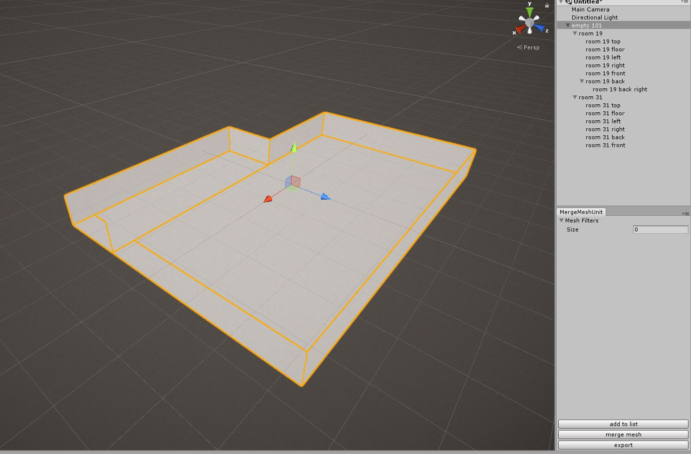
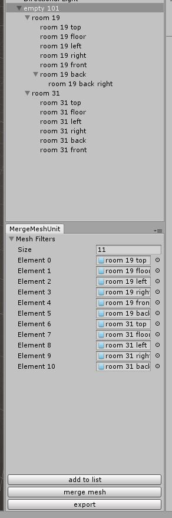
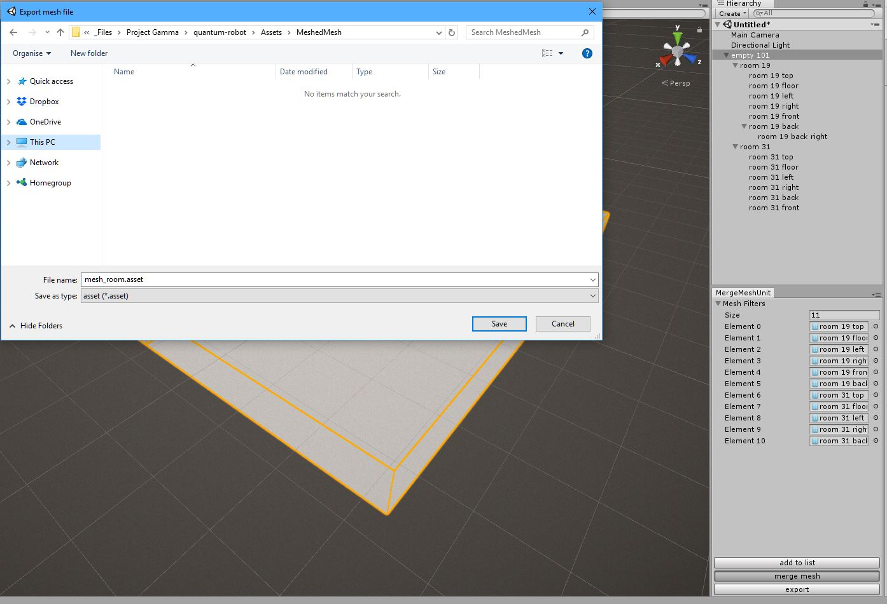
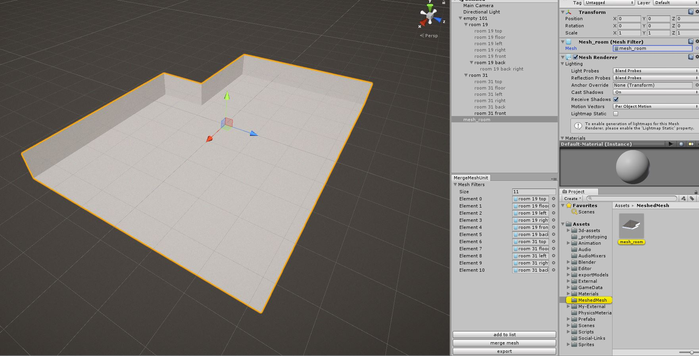
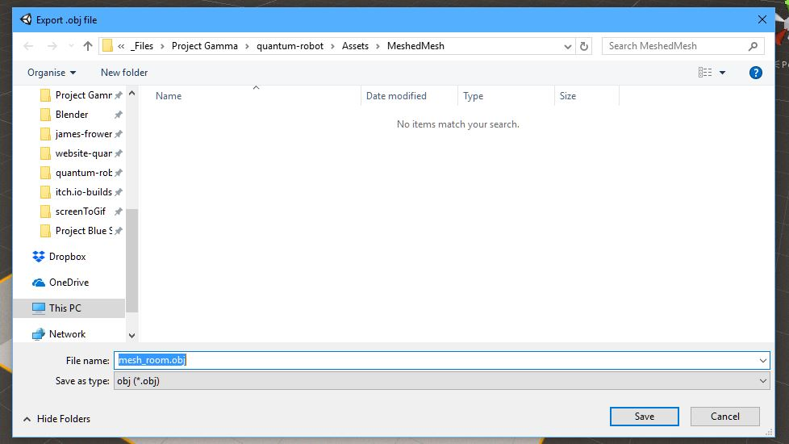
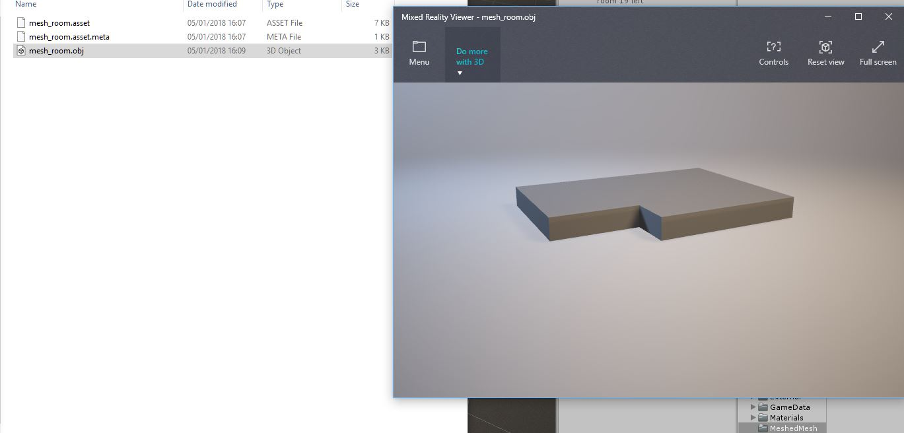

# Merge Mesh in Unity3d

Custom editor window unity to merge and export mesh.

# Install

Add code from the source folder to Assets in unity.

# How to use

This tool editor tool has 2 uses: merge multiple mesh into 1 mesh and export mesh to .obj.

## Merge mesh

For this example I have created a room made out of multiple Quads. *(Note the order in the hierarchy is not important)*

Add the `Mesh Filter` of the objects you want to merge. Using the `add to list` button will add all selected `Mesh Filter`.

The `merge mesh` button will merge the mesh and open a window to save the mesh asset file for unity to use.
 

After the mesh has been merged, an object using the new mesh will be added to the scene and all of the old objects will be disabled.

## Export mesh

To export the Mesh as an `.obj` file select the `GameObject` in the scene and press the export button. A window will open for the save location.

Once the object has been exported it can be used by other 3d viewer and editors.

# Bugs?

If you find a bug while using the tool or just have a suggestion please create a new issue on github or tweet [@JamesFrowenDev](https://twitter.com/JamesFrowenDev) 